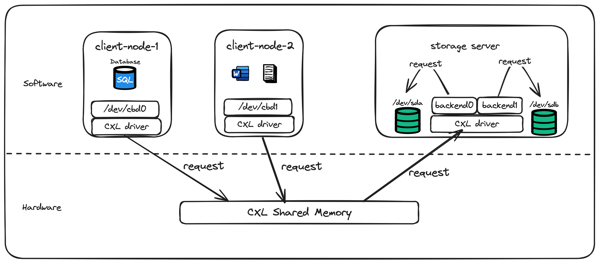

# CBD （CXL Block Device）

As shared memory is supported in CXL3.0 spec, we can transfer data via CXL shared memory. CBD means CXL block device, it use CXL shared memory 
to transfer command and data to access block device in different host, as shown below:

 

## cbd Linux kernel modules

The CBD kernel module is part of the Linux kernel, maintained under the DataTravelGuide organization.

[cbd kernel module source tree](https://github.com/DataTravelGuide/linux)

It has currently sent an RFC version to the Linux community.

[CBD RFC](https://lore.kernel.org/lkml/20240422071606.52637-1-dongsheng.yang@easystack.cn/)

 

## cbd userspace tool

The CBD user-space command is a subcommand in the ndctl project and is currently under development.

[cbd userspace tool](https://github.com/DataTravelGuide/ndctl)

 

## cbd test suites

cbd-tests is an automated test suite based on the Avocado test framework, specifically designed for CBD. 
It includes performance tests (fio), data read/write tests (xfstests), and other tests (continuously being added).

[cbd-tests](https://github.com/DataTravelGuide/cbd-tests)

 

### test results

The test reports for cbd-tests are automatically generated by Avocado.
They include information about the runtime environment, all test results, detailed test processes for each test case, and more.

[test-result-v1](./test-results/test_result_v1/results.html)

   

